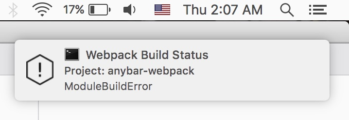

[](http://badge.fury.io/js/anybar-webpack)
[](https://travis-ci.org/roman01la/anybar-webpack)
[](https://www.npmjs.org/package/anybar-webpack)

# AnyBarWebpackPlugin
[Webpack](http://webpack.github.io/) build status plugin for status bar indicator applications.


Now with cross-platform native notifications, thanks to [node-notifier](https://github.com/mikaelbr/node-notifier).



*__Note__: Notifies only about build errors.*

## Known apps

- [AnyBar](https://github.com/tonsky/AnyBar) on OS X
- [somebar](https://github.com/limpbrains/somebar) on Linux

## Known issues

### No notifications when running from tmux
Please, follow [this instructions](https://github.com/julienXX/terminal-notifier/issues/115#issuecomment-104214742). After that, update tmux config: `tmux source-file ~/.tmux.conf`.

## Installation

Make sure you have an application installed and running

```
npm i -D anybar-webpack
```

## Usage

Use it in your `webpack.config.js`:

```javascript
var AnyBarWebpackPlugin = require('anybar-webpack');

module.exports = {
    // ...
    plugins: [
        new AnyBarWebpackPlugin({
            enableNotifications: true
        })
    ]
    // ...
};
```

## API

### `new AnyBarWebpackPlugin([port][, host][, options])`
All arguments are optional. If you want to pass the `host` argument, you need to pass a `port` first.

### `port`
- Type: `Number`
- Default: `1738`

The port the status bar application is running on.

### `host`
- Type: `String`
- Default: `'127.0.0.1'`

The host the status bar application is running on.

### `enableNotifications`
- Type: `Boolean`
- Default: `false`

Enable build errors desktop notifications.
